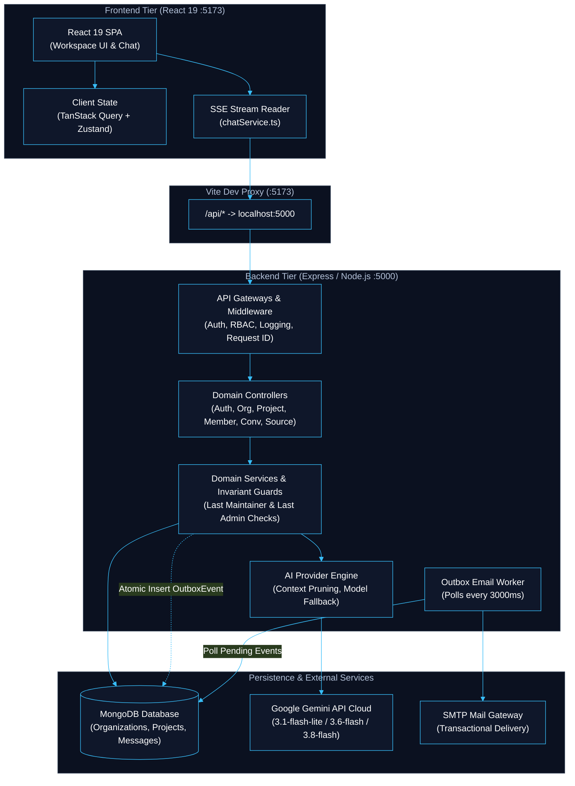
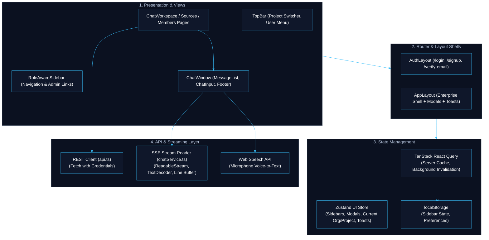
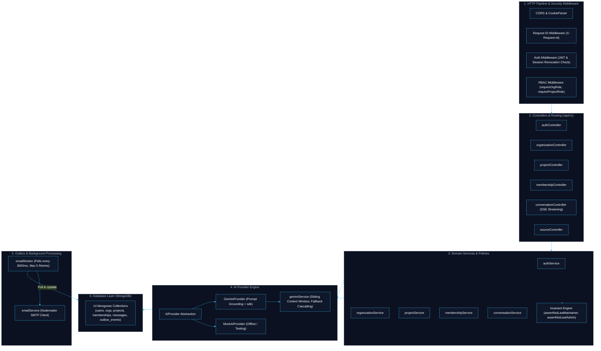
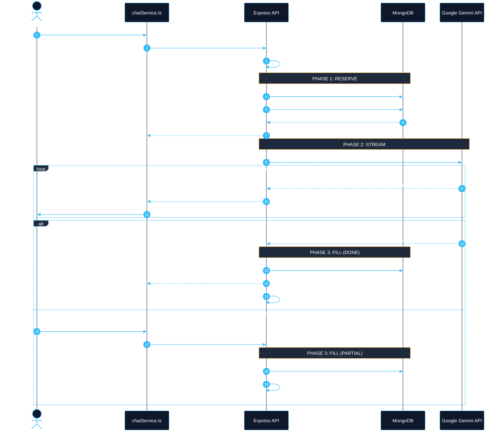

# DevAI — High-Level Architecture (HLD)

## 1. Overall System High-Level Architecture (System HLD)

**DevAI** is a multi-tenant, project-centric AI developer workspace and assistant powered by Google Gemini (`@google/genai`).

The platform consists of a **React 19 Frontend**, an **Express / Node.js Backend**, a **MongoDB Database**, a **Transactional Outbox Worker**, and the **Google Gemini Cloud API**.



### Core System Principles
1. **Multi-Tenancy Hierarchy**: `Organization` ➔ `Project` ➔ `Conversation` ➔ `Message` & `Attachment`.
2. **Context-Bound Authorization**: Roles belong to memberships (`ADMIN`/`MEMBER` in orgs, `MAINTAINER`/`DEVELOPER` in projects), never to users globally.
3. **Domain Survival Invariants**: Projects cannot lose their last `MAINTAINER`; organizations cannot lose their last `ADMIN`.
4. **Transactional Outbox**: Emails and notifications are inserted as database events atomically with mutations, completely avoiding dual-write failures.

---

## 2. Frontend High-Level Architecture (FE HLD)

The frontend is a single-page application built with **React 19**, **Vite**, **Tailwind CSS**, and **TypeScript**.



### Frontend Responsibilities
- **Layouts & Route Guarding**: [`AppLayout.tsx`](file:///c:/Users/Vikas/Desktop/Dev-AI/frontend/src/layouts/AppLayout.tsx) provides a unified workspace with top bar, collapsible sidebar, and toast notifications. [`AuthLayout.tsx`](file:///c:/Users/Vikas/Desktop/Dev-AI/frontend/src/layouts/AuthLayout.tsx) wraps onboarding and auth.
- **Server Cache Management**: Uses `@tanstack/react-query` to cache and synchronize server state across projects, conversations, members, and sources.
- **Global UI Store**: Uses Zustand ([`useUIStore.ts`](file:///c:/Users/Vikas/Desktop/Dev-AI/frontend/src/stores/useUIStore.ts)) for active context, dual sidebar states (navigation and chat history), and modal dialogs.
- **Voice-to-Text**: Integrates the native browser Web Speech API for real-time speech input.
- **SSE Stream Consumer**: Consumes real-time token chunks via `fetch` and `ReadableStream.getReader()`, parsing Server-Sent Events line by line.

---

## 3. Backend High-Level Architecture (BE HLD)

The backend is an **Express / Node.js** service structured into distinct layers: middleware, controllers, domain services, security policies, background workers, and data persistence.



### Backend Responsibilities
- **Authentication**: Supports dual-mode authentication via HTTP-only signed cookies (`devai_session`) and `Bearer` JWT tokens, coupled with active session verification in MongoDB.
- **RBAC & Invariant Enforcement**: Protects routes using `requireOrgRole` and `requireProjectRole`, and protects role changes with [`assertNotLastMaintainer`](file:///c:/Users/Vikas/Desktop/Dev-AI/backend/src/policies/invariants.ts#L10-L34) and [`assertNotLastAdmin`](file:///c:/Users/Vikas/Desktop/Dev-AI/backend/src/policies/invariants.ts#L40-L62).
- **Credentials Encryption**: Sensitive third-party source tokens (GitHub, Jira) are encrypted at rest using **AES-256-GCM**.
- **Transactional Outbox Worker**: Decouples email sending from HTTP request lifecycles.

---

## 4. Server-Sent Events (SSE) Streaming HLD — How It Works

### 4.1 Why SSE Over WebSockets?
- **Unidirectional Communication**: AI text generation is strictly server-to-client streaming. SSE is purpose-built for unidirectional server push over standard HTTP.
- **Native HTTP/2 Multiplexing**: SSE operates seamlessly over existing HTTP infrastructure, proxies, and SSL/TLS without requiring custom protocol upgrades.
- **Simpler Resilience & Cancellation**: The client cancels generation cleanly using standard browser `AbortController`, closing the HTTP connection without maintaining persistent socket states.

---

### 4.2 SSE Streaming High-Level Sequence

The diagram below outlines the **"Reserve-Then-Fill"** streaming architecture with high-contrast signal lines and pure white text:



---

### 4.3 How the Streaming Pipeline Works Step-by-Step

| Phase | Component | Action | Description |
|---|---|---|---|
| **1. Request** | [`ChatWindow.tsx`](file:///c:/Users/Vikas/Desktop/Dev-AI/frontend/src/components/ChatWindow.tsx) | Optimistic Turn & AbortController | Renders user message immediately in UI, attaches an `AbortController`, and sends POST to `/messages/stream`. |
| **2. SSE Init** | [`conversationController.ts`](file:///c:/Users/Vikas/Desktop/Dev-AI/backend/src/controllers/conversationController.ts) | Header Flush | Sets `Content-Type: text/event-stream`, `Connection: keep-alive`, and calls `res.flushHeaders()` to bypass proxy buffering. |
| **3. Reserve** | [`conversationService.ts`](file:///c:/Users/Vikas/Desktop/Dev-AI/backend/src/services/conversationService.ts) | Advance Reservation | Persists User turn (`status: DONE`), then creates Assistant placeholder with `status: STREAMING` in MongoDB. Sends `{"type": "start", "assistantMessageId": "..."}` to the client. |
| **4. Inference** | [`geminiService.ts`](file:///c:/Users/Vikas/Desktop/Dev-AI/backend/src/services/geminiService.ts) | Context Pruning & Fallback | Applies sliding window (10 turns, 32k char budget). Cascades model fallback: `3.1-flash-lite` ➔ `3.6-flash` ➔ `3.8-flash`. |
| **5. Chunks** | Express ➔ [`chatService.ts`](file:///c:/Users/Vikas/Desktop/Dev-AI/frontend/src/services/chatService.ts) | SSE Event Stream | Emits `data: {"type": "chunk", "text": "..."}\n\n`. Client decodes bytes via `ReadableStream` and renders Markdown. |
| **6. Fill (Done)**| [`conversationService.ts`](file:///c:/Users/Vikas/Desktop/Dev-AI/backend/src/services/conversationService.ts) | State Finalization | On stream end, updates the MongoDB row to `status: "DONE"` with token counts and duration. Emits `{"type": "done"}`. |
| **7. Abort** | Express Controller | Cancellation Guard | If client cancels, catches abort signal, saves partial text to MongoDB with `status: "PARTIAL"`, preventing message loss. |

---

## 5. Key System Information & Quick Reference

### 5.1 Technology Stack Summary
- **Frontend**: React 19, TypeScript, Vite, Tailwind CSS, TanStack React Query, Zustand, Lucide Icons.
- **Backend**: Node.js, Express, TypeScript, Mongoose (MongoDB), Winston Logger.
- **AI Cloud**: Google Gemini API (`@google/genai`) with model cascading and context pruner.
- **Worker & Mail**: Transactional Outbox Pattern, Polling Email Worker, Nodemailer SMTP.

### 5.2 Key Invariants & Safeguards
- **`assertNotLastMaintainer`**: A project workspace must always have $\ge 1$ active Maintainer.
- **`assertNotLastAdmin`**: An organization tenant must always have $\ge 1$ active Admin.
- **AES-256-GCM Encryption**: Third-party OAuth tokens and secrets encrypted at rest.
- **Session Revocation**: Bearer tokens and cookies checked against server-side session state on every authenticated call.

### 5.3 Common Development Commands
```bash
# Run both frontend and backend concurrently
npm run dev

# Run individual workspaces
npm run dev:backend    # Port 5000
npm run dev:frontend   # Port 5173

# Run core invariant verification suite
cd backend && npx tsx tests/v1_core_invariants.test.ts
```
