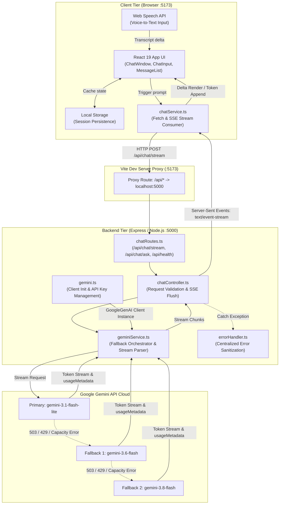
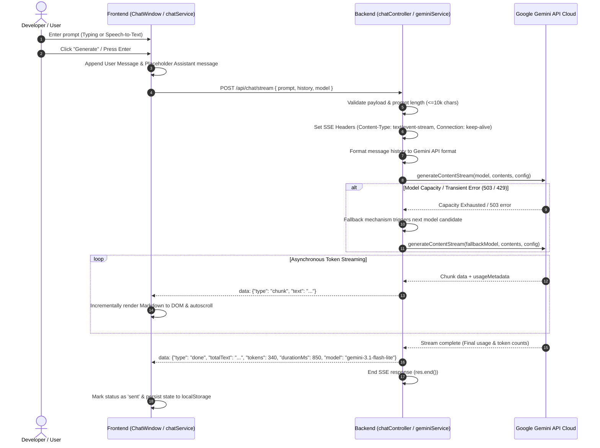

# Architecture v1 - DevAI

## 1. Overview

**DevAI** is an AI-powered developer assistant built on a modern monorepo architecture with an asynchronous streaming pipeline connecting a **React 19 Frontend** (powered by Vite) to an **Express/Node.js Backend** and **Google Gemini Models via `@google/genai`**.

---

## 2. High-Level System Architecture Diagram

---

## 3. End-to-End Sequence & Communication Flow

---

## 4. Component Breakdown & Responsibilities

### 4.1 Frontend Layer (`frontend/`)

- **[ChatWindow.tsx](file:///c:/Users/Vikas/Desktop/Dev-AI/frontend/src/components/ChatWindow.tsx)**: Orchestrates chat state, local storage persistence, scroll management, retry logic, and cancellation control via `AbortController`.
- **[ChatInput.tsx](file:///c:/Users/Vikas/Desktop/Dev-AI/frontend/src/components/ChatInput.tsx)**: Handles text input, auto-expanding textarea, character limits, keyboard shortcuts (`Enter`, `Esc`), and continuous microphone input via Web Speech API.
- **[MessageList.tsx](file:///c:/Users/Vikas/Desktop/Dev-AI/frontend/src/components/MessageList.tsx)** & **[MessageItem.tsx](file:///c:/Users/Vikas/Desktop/Dev-AI/frontend/src/components/MessageItem.tsx)**: Renders user turns and assistant responses with real-time token stream rendering, syntax-highlighted code blocks, copy actions, and thumbs up/down feedback.
- **[chatService.ts](file:///c:/Users/Vikas/Desktop/Dev-AI/frontend/src/services/chatService.ts)**: Implements browser `ReadableStream` consumption to parse Server-Sent Events (`data: {...}`) line by line, handling chunk emissions and abort signals.

### 4.2 Backend Layer (`backend/`)

- **[index.ts](file:///c:/Users/Vikas/Desktop/Dev-AI/backend/src/index.ts)**: Configures Express app, CORS policies, JSON body parser limits, routes, and server listener.
- **[chatRoutes.ts](file:///c:/Users/Vikas/Desktop/Dev-AI/backend/src/routes/chatRoutes.ts)**: Exposes endpoints for streaming chat (`POST /api/chat/stream`), non-streaming fallback (`POST /api/chat/ask`), and health checks (`GET /api/health`).
- **[chatController.ts](file:///c:/Users/Vikas/Desktop/Dev-AI/backend/src/controllers/chatController.ts)**: Handles input sanitization, validates 10k character limits, manages HTTP SSE connection lifecycle, and listens for client disconnect events.
- **[geminiService.ts](file:///c:/Users/Vikas/Desktop/Dev-AI/backend/src/services/geminiService.ts)**:
  - Formats user & assistant chat history into the Gemini API `contents` schema.
  - Applies system instructions customized for developer engineering assistance.
  - Implements automatic model fallback cascading (`gemini-3.1-flash-lite` -> `gemini-3.6-flash` -> `gemini-3.8-flash`) upon encountering transient capacity or 503/429 errors.
  - Calculates tokens and execution durations.
- **[gemini.ts](file:///c:/Users/Vikas/Desktop/Dev-AI/backend/src/config/gemini.ts)**: Manages lazy initialization of the `@google/genai` `GoogleGenAI` client using `process.env.GEMINI_API_KEY`.
- **[errorHandler.ts](file:///c:/Users/Vikas/Desktop/Dev-AI/backend/src/middleware/errorHandler.ts)**: Intercepts unhandled errors, parses internal Google GenAI errors, and formats sanitized responses for client consumption.

---

## 5. Resilience & Fault-Tolerance Features

1. **Automatic Model Failover**: If the primary Gemini model experiences transient rate-limits (429) or high capacity demand (503), the backend automatically retries with secondary fallback models before failing the request.
2. **Client Disconnection Detection**: The streaming controller tracks `res.on('close')` and `req.on('aborted')` events to cancel upstream token generation and release backend compute resources.
3. **Local Storage Fallback**: User chats are preserved in the browser's `localStorage` across page reloads.
4. **Non-blocking Dev Proxy**: Vite proxies `/api` calls directly to the Express backend without CORS configuration hurdles during development.
